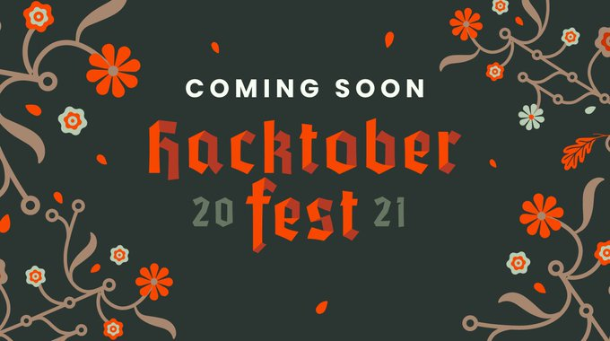

# 🎃 🎯   HacktoberFest 2021  🎃🎯 
# Make your first Pull Request and earn a free T-shirt 👕👕 from GitHub!
# Star & fork this Repo first

## All valid PRs will be merged or suitable tags like hacktober-accepted will be given 

Use this project to make your first contribution to an open source project on GitHub. Practice making your first pull request to a public repository before doing the real thing!

Celebrate [Hacktoberfest](https://hacktoberfest.digitalocean.com/) by getting involved in the open source community by completing some simple tasks in this project.

This repository is open to all members of the GitHub community. Any member may contribute to this project without being a collaborator.

## What is Hacktoberfest?
A month-long celebration from October 1st - 31st sponsored by [Digital Ocean](https://hacktoberfest.digitalocean.com/) and [GitHub](https://github.com/blog/2433-celebrate-open-source-this-october-with-hacktoberfest) to get people involved in [Open Source](https://github.com/open-source). Create your very first pull request to any public repository on GitHub and contribute to the open source developer community.

[https://hacktoberfest.digitalocean.com/](https://hacktoberfest.digitalocean.com/)

## How to contribute to this project
Here are 3 quick and painless ways to contribute to this project:

* Add your name to the `Profile.md` file
* There are various sections like CP , Development , Interview etc , Add valuable resources


# For Beginners
1) Visit & Learn 
[Tutorial Github ](https://www.youtube.com/playlist?list=PL4cUxeGkcC9goXbgTDQ0n_4TBzOO0ocPR)
2) Copy the template and write hacktoberfest in your language
3) Make a pull request
4) Wait until your pull request is merged
## Enjoy , You have made it

## Getting started
* Fork this repository (Click the Fork button in the top right of this page, click your Profile Image)
* Clone your fork down to your local machine

```markdown
git clone https://github.com/your-username/hacktoberfest.git
```

* Create a branch

```markdown
git checkout -b branch-name
```

* Make your changes (choose from any task below)
* Commit and push

```markdown
git add .
git commit -m 'Commit message'
git push origin branch-name
```

* __Star this repository__ 
* Create a new pull request from your forked repository (Click the `New Pull Request` button located at the top of your repo)
* Wait for your PR review and merge approval!

# Add sub-folders of your name and put files into respective sub-folders
#### Example - >
```
project
│   README.md
│   file001.txt    
│
└───folder1
│   └───subfolder1(your name + github id( optional ))
│       │   file111.cpp
│       │   file112.js
│       │   ...
│   
└───folder2
```


## Choose from these tasks
### 1. Add your name
Add your name to the `Profile.md` file using the below convention:

```markdown
#### Name: [YOUR NAME](GitHub link)
- Bio: Who are you?
- GitHub: [GitHub account name](GitHub link)
```

### 2. Add a profile page
Add a `Your_Name.md` file to the `profiles` directory. Use any combination of content and Markdown you'd like. Here is an example:

```markdown
# Your Name

### Location

Your City/Country

### Academics

Your School

### Interests

- Some Things You Like

### Development

- Inventor of the My Pillow

### Projects

- [My Project](GitHub Link) Short Description

### Profile Link

[Your Name](GitHub Link)
```

### 3. Create a `Hello, World!` Script
Add a `hello_world_yourusername.xx` script to the `scripts` directory in any language of your choice! Here is an example:

```Javascript
// LANGUAGE: Javascript
// ENV: Node.js
// AUTHOR: Alice Chuang
// GITHUB: https://github.com/AliceWonderland

console.log('Hello, World!');
```


# Reference links

##### Creating awesome readme Online : [https://dillinger.io/](https://dillinger.io/)

##### Managing Forked Repos: [https://help.github.com/articles/fork-a-repo/](https://help.github.com/articles/fork-a-repo/)

##### Syncing a Fork repo: [https://help.github.com/articles/syncing-a-fork/](https://help.github.com/articles/syncing-a-fork/)

##### Checkout this list for README examples - Awesome README [](https://github.com/sindresorhus/awesome)

##### Github-Flavored Markdown [https://guides.github.com/features/mastering-markdown/](https://guides.github.com/features/mastering-markdown/)

# Star this Repo first
